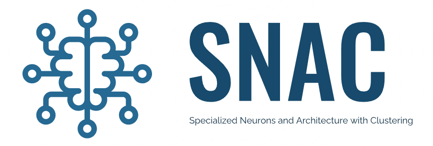

# SNAC: Specialized Neurons and Clustering Architecture

This repository presents a Hierarchical Reinforcement Learning (HRL) approach in Grid World, incorporating **Successor Features (SFs)** with the following enhancements:
- **Clustering in eigenspace** to prevent information loss by utilizing all computed eigenvectors.
- **Simultaneous reward and state feature decompositions** to adapt to both the reward structure and navigational diffusion properties of the environment.

Additionally, this repository includes implementations of previous state-of-the-art (SOTA) methods, such as **EigenOption**, **CoveringOption**, and a naive **PPO** approach, serving as baselines. For further details, please refer to the workshop paper of the older version of [SNAC](https://ala2022.github.io/papers/ALA2022_paper_41.pdf).

---

## Pre-requisites

Before using this repository, it is recommended to be familiar with the following papers:

- [EigenOption Discovery with Deep Successor Features](https://openreview.net/pdf?id=Bk8ZcAxR-)
- [RL with Deep Covering Option](https://openreview.net/pdf?id=SkeIyaVtwB)

### Summary

- **EigenOption** selects the top `n` eigenvectors from a diffusive-type matrix (e.g., graph Laplacian, Successor Representation, Successor Features).
- **CoveringOption** selects the top 1 eigenvector and iteratively updates the diffusive matrix to find a better-explaining matrix, particularly effective in environments with hard-to-explore states.

In addition, due to the non-uniqueness of the sign by SVD decomposition, we count one eigenvector as two vectors such that e = (+e/-e).
---

## Usage

To create a conda environment, run the following commands:

```bash
conda create --name myenv python==3.10.*
conda activate myenv
```
Then, install the required packages using pip:
```
pip install -r requirements.txt
```
For the execution of each algorithms presented here, run the following command

```
python3 main.py --algo-name SNAC --num-vector 10 
```
where algo-name = {SNAC, EigenOption, CoveringOption, PPO} and num-vector is the total number of eigenpurposes each algorithmn will use.
